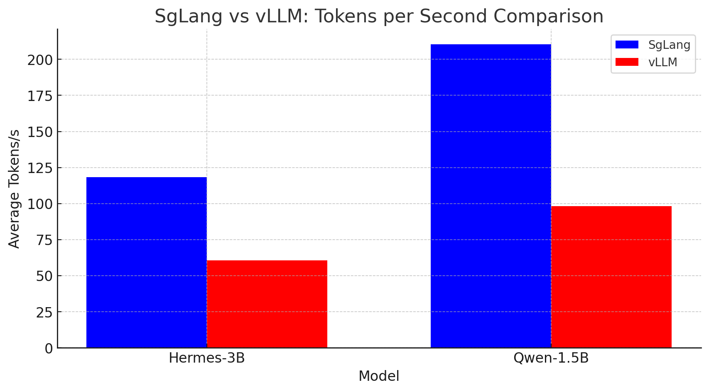

# SgLang-vs-vLLM Comparison

## on RTX 4090

---

## 💻 SgLang

### Model: NousResearch/Hermes-3-Llama-3.2-3B

| Prompt Tokens | Time (s) | Memory (MB) | GPU Mem (MB) | Tokens/s |
|--------------|---------|------------|-------------|----------|
| 123 | 1.30 | 0.10 | 30.00 | 94.55 |
| 121 | 1.03 | 0.02 | 0.00 | 117.60 |
| 124 | 1.02 | 0.01 | 0.00 | 121.13 |
| 125 | 1.03 | 0.02 | 0.00 | 121.70 |
| 127 | 1.03 | 0.01 | 0.00 | 123.86 |
| ... | ... | ... | ... | ... |

### Overall Metrics
- **Total Tokens:** 1628
- **Total Time:** 13.76 seconds
- **Average Tokens/s:** 118.34
- **CPU Usage:** 0.00%
- **Memory Usage:** 953.74 MB
- **GPU Utilization:** 96.00%

### Model: Qwen/Qwen2.5-Coder-1.5B-Instruct

| Prompt Tokens | Time (s) | Memory (MB) | GPU Mem (MB) | Tokens/s |
|--------------|---------|------------|-------------|----------|
| 127 | 0.74 | 0.11 | 30.00 | 170.57 |
| 126 | 0.58 | 0.03 | 0.00 | 217.89 |
| 128 | 0.59 | 0.01 | 0.00 | 218.64 |
| ... | ... | ... | ... | ... |

### Overall Metrics
- **Total Tokens:** 1648
- **Total Time:** 7.83 seconds
- **Average Tokens/s:** 210.48
- **CPU Usage:** 10.00%
- **Memory Usage:** 932.45 MB
- **GPU Utilization:** 55.00%

---

## 📊 VLLM

### Model: NousResearch/Hermes-3-Llama-3.2-3B

| Prompt Tokens | Time (s) | Memory (MB) | GPU Mem (MB) | Tokens/s |
|--------------|---------|------------|-------------|----------|
| 12 | 0.39 | 0.20 | 4.00 | 30.97 |
| 15 | 0.20 | 0.04 | 0.00 | 76.53 |
| 15 | 0.20 | 0.03 | 0.00 | 74.40 |
| ... | ... | ... | ... | ... |

### Overall Metrics
- **Total Tokens:** 183
- **Total Time:** 3.02 seconds
- **Average Tokens/s:** 60.69
- **CPU Usage:** 0.00%
- **Memory Usage:** 5701.59 MB
- **GPU Utilization:** 31.00%

### Model: Qwen/Qwen2.5-Coder-1.5B-Instruct

| Prompt Tokens | Time (s) | Memory (MB) | GPU Mem (MB) | Tokens/s |
|--------------|---------|------------|-------------|----------|
| 13 | 0.23 | 0.21 | 4.00 | 55.5 |
| 15 | 0.13 | 0.04 | 0.00 | 112.34 |
| 14 | 0.13 | 0.04 | 0.00 | 110.14 |
| ... | ... | ... | ... | ... |

### Overall Metrics
- **Total Tokens:** 178
- **Total Time:** 1.81 seconds
- **Average Tokens/s:** 98.27
- **CPU Usage:** 0.00%
- **Memory Usage:** 5759.47 MB
- **GPU Utilization:** 50.00%

---

## 📅 Notes
- This comparison evaluates **SgLang** and **vLLM** on an **RTX 4090**.
- Performance is assessed based on:
  - **Tokens per second (Tokens/s)**
  - **Memory usage**
  - **GPU utilization**
- Differences in performance may depend on **system configurations** and **workload variations**.

---

## 🐟 References
- **Hugging Face Models Used:**
  - [NousResearch/Hermes-3-Llama-3.2-3B](https://huggingface.co/NousResearch/Hermes-3-Llama-3.2-3B)
  - [Qwen/Qwen2.5-Coder-1.5B-Instruct](https://huggingface.co/Qwen/Qwen2.5-Coder-1.5B-Instruct)
- **Frameworks & Libraries:**
  - [SgLang](https://github.com/example/sglang) *(Replace with actual link)*
  - [vLLM](https://github.com/example/vllm) *(Replace with actual link)*
  - [PyTorch](https://pytorch.org/)
  - [CUDA](https://developer.nvidia.com/cuda-toolkit)
  - [Hugging Face Transformers](https://huggingface.co/docs/transformers/index)

---

## 🌟 License
This project is open-source and licensed under the **Apache 2.0**.

